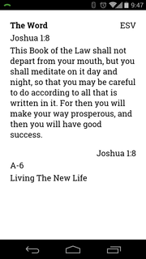
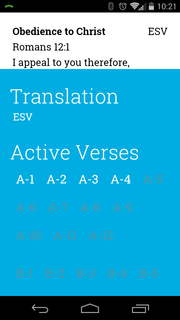

Verse Pack
====================

Verse Pack is a mobile app to help you memorize Scripture using the Navigators [Topical Memory System](http://www.navigators.org/Tools/Discipleship%20Resources/Tools/Topical%20Memory%20System). Instead of carrying around a whole bunch of little flash cards, just load Verse Pack on your phone, and you'll always have your verses with you, so you can memorize them on the go.

Screenshots
--------------------
 

Download
--------------------
Verse Pack is currently available on the Google Play Store, and coming soon to the Apple AppStore and the Windows Phone Store. Click the link below to download the latest version.

Please Donate
--------------------
This app is available for anyone to download for free, just as I believe it should be. I do not display advertisements in my apps because I believe they look unprofessional, and distract the user from the content they want. But testing and publishing smartphone apps is not without cost. Test hardware and developer subscriptions are expensive. If you find this app useful, please consider donating to the cause!

